## 00

### Major Hebrew-B (ס/ז/צ + ס/ז/צ)

- **זוס** (Zeus) — **ז**ו**ס** → ז+ס = 00 ✓ | same as HE-A; ז=0, ס=0

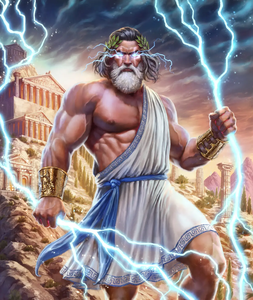

---

## 01

### Major Hebrew-B (ס/ז/צ + ת/ט/ד)
*(HE-B: 1 = ת/ט/ד; these were in HE-A slot 04)*

- **סטלון** (Sylvester Stallone) — **ס**ט → ס+ט = 01 ✓ | Rocky's fists, Rambo

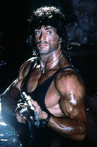

- **זידאן** (Zinedine Zidane) — **ז**ד → ז+ד = 01 ✓ | soccer GOAT, headbutt in 2006 World Cup final *(⚠️ HE-A = 04)*

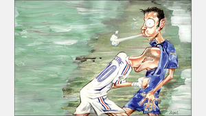

---

## 02

### Major Hebrew-B (ס/ז/צ + נ)
*(HE-B: 2 = נ only; ב is NOT 2 here — ב-soft=8, ב-hard=9)*

- **סנטה קלאוס** (Santa Claus) — **ס**נ → ס+נ = 02 ✓ | same as HE-A

- **סוניק הקיפוד** (Sonic) — **ס**נ → ס+נ = 02 ✓ | blue blur, gold rings, attitude

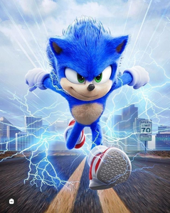

---

## 03

### Major Hebrew-B (ס/ז/צ + מ)
*(HE-B: 3 = מ; these were in HE-A slot 08)*

- **סמואל ל. ג'קסון** (Samuel L. Jackson) — **ס**מ → ס+מ = 03 ✓ | "Say what again!", purple lightsaber *(⚠️ HE-A = 08; matches EN slot 03)*

- **סמוראי** (Samurai) — **ס**מ → ס+מ = 03 ✓ | katana, black armor, deadly stance

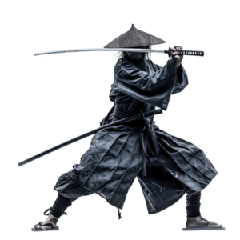

---

## 04

### Major Hebrew-B (ס/ז/צ + ר)

- **זורו** (Zorro) — **ז**ר → ז+ר = 04 ✓ | masked hero, black outfit, Z slashed everywhere *(⚠️ HE-A = 07)*

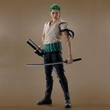

---

## 05

### Major Hebrew-B (ס/ז/צ + ל)
*(HE-B: 5 = ל; these were in HE-A slot 01)*

- **סלבדור דאלי** (Salvador Dalí) — **ס**ל → ס+ל = 05 ✓ | melting clocks, insane moustache *(⚠️ HE-A = 01)*

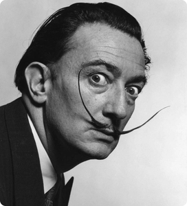

- **סול גודמן** (Saul Goodman) — **ס**ל → ס+ל = 05 ✓ | shady lawyer, flashy suits, "Better Call Saul" *(⚠️ HE-A = 01)*

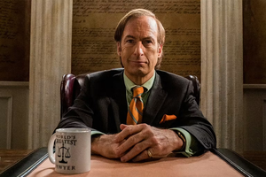

---

## 06

### Major Hebrew-B (ס/ז/צ + ש/צ׳/ג׳/ז׳)
*(HE-B: 6 = ש/צ׳/ג׳/ז׳ — same pattern as HE-A slot 06)*

- **סאשה ברון כהן** — **ס**ש → ס+ש = 06 ✓ | same as HE-A

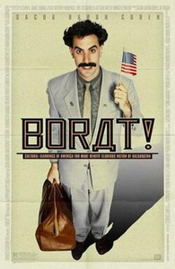

---

## 07

### Major Hebrew-B (ס/ז/צ + ק/כּ/ג-hard)
*(HE-B: 7 = ק/כ-hard/ג-hard; these were in HE-A slot 03)*

- **סוקרטס** (Socrates) — **ס**ק → ס+ק = 07 ✓ | barefoot philosopher, hemlock, Socratic method *(⚠️ HE-A = 03)*

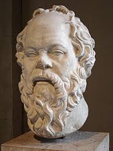

- **סקארלט** (Scarlett Johansson) — **ס**ק → ס+ק = 07 ✓

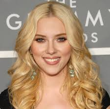

---

## 08

### Major Hebrew-B (ס/ז/צ + פ-רפה/ו/ב-רפה)
*(HE-B: 8 = f/v sounds — פ without dagesh, ו as "v", ב without dagesh)*

- **סופיה ורגרה** (Sofia Vergara) — **ס**ו → ס+ו(v) = 08 ✓ | Gloria from Modern Family, accent so thick it became the whole character

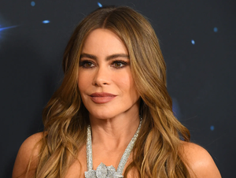

- **זאב ז'בוטינסקי** (Ze'ev Jabotinsky) — **ז**+**ב**(v) = 08 ✓ | iron wall doctrine, never backed down — זאב (wolf) = ז+ב, same encoding

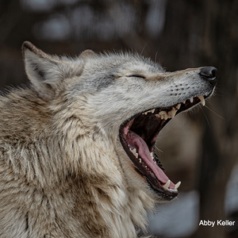

---

## 09

### Major Hebrew-B (ס/ז/צ + פ-דגושה/ב-דגושה)
*(HE-B: 9 = p/b hard sounds — פ with dagesh (p-sound), ב with dagesh (b-sound))*

- **ספיידר-מן** (Spider-Man) — **ס**פּ → ס+פ(p) = 09 ✓ | web-slinging, red-and-blue suit, "With great power…"

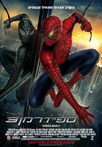
